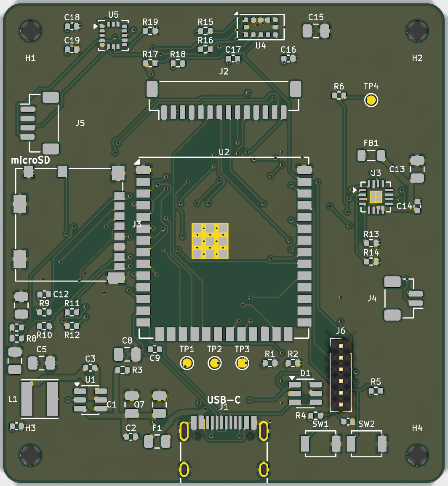
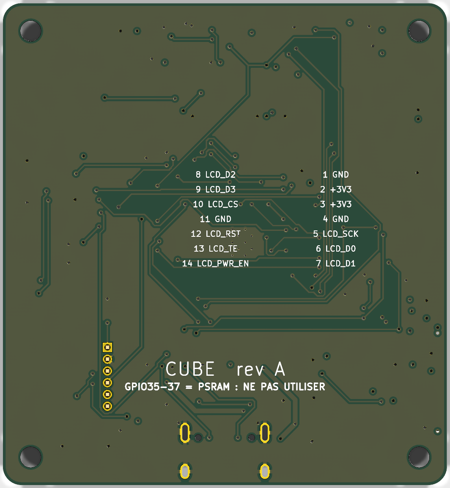
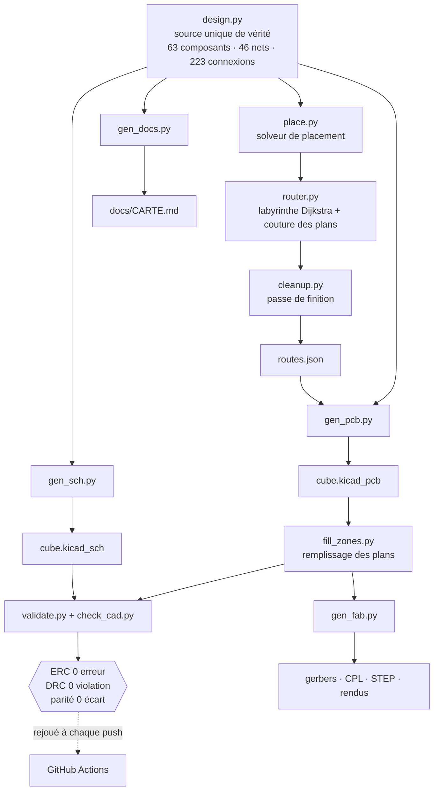
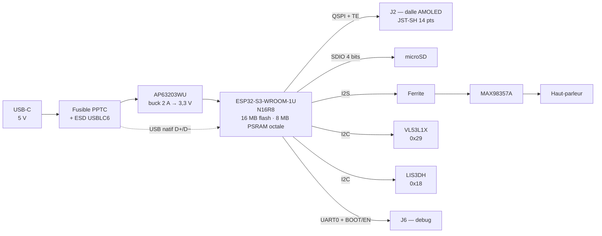

<div align="center">

<picture>
  <source media="(prefers-color-scheme: dark)" srcset="docs/media/banner-dark.svg">
  <source media="(prefers-color-scheme: light)" srcset="docs/media/banner-light.svg">
  
</picture>

# CUBE

**Carte électronique d'un afficheur holographique de bureau — conçue entièrement par du code, vérifiée automatiquement.**

[](https://github.com/Honzaaa45/cube-hologram-pcb/actions/workflows/ci.yml)
[](LICENSE)
[](LICENSE-HARDWARE)
[](https://www.kicad.org/)
[](https://www.python.org/)
[](hw/drc.rpt)

</div>

---

## Aperçu

Le circuit imprimé, rendu depuis les fichiers de ce dépôt. Fond transparent : lisible en thème clair comme en thème sombre.

<div align="center">
  
  
</div>

> [!NOTE]
> **La carte n'a pas encore été fabriquée.** Les images ci-dessus sont des rendus 3D produits par KiCad
> à partir des fichiers du dépôt, pas des photos. L'emplacement `docs/media/demo.gif` est réservé pour
> la démonstration du prototype physique — voir [ce qu'il reste à faire](#état-davancement).

## Pourquoi ce projet

Les afficheurs « holographiques » DIY qu'on trouve en ligne se ressemblent tous : un ESP32, un petit écran
OLED monochrome et une breadboard. Le résultat est saccadé, minuscule, et l'électronique est visible.
Ce projet répond à la même envie mais en produit final : image couleur fluide, électronique intégrée sur
une carte sur mesure, et surtout une conception **vérifiable** plutôt que dessinée à la main.

## Le principe optique

L'illusion s'appelle *Pepper's Ghost*. Une dalle posée à plat éclaire un cube séparateur de faisceau ;
la lame à 45° à l'intérieur du cube renvoie l'image vers l'observateur, qui la voit flotter dans le verre.

**La conséquence, et c'est tout le projet :** en Pepper's Ghost, **le noir de l'image est la transparence**.
Un écran LCD, dont le noir est gris, ferait flotter un rectangle lumineux autour du sujet. Un pixel AMOLED
éteint n'émet rien, donc disparaît vraiment. Ce constat commande l'ensemble des choix matériels.

## Architecture

Ce dépôt n'est pas un projet KiCad : c'est une **chaîne de génération** dont KiCad est la sortie.
`design.py` est la seule source de vérité ; tout le reste en découle et se recalcule.



<details>
<summary><b>Architecture matérielle de la carte</b> (cliquer pour dérouler)</summary>



</details>

## Démarrage rapide

Il faut **Python 3.9+** et **KiCad 9** installé : les scripts lisent ses bibliothèques officielles de
symboles et d'empreintes. Aucune dépendance Python à installer pour la vérification.

```bash
git clone https://github.com/Honzaaa45/cube-hologram-pcb.git
```

```bash
cd cube-hologram-pcb
```

Vérifier que la conception est cohérente (14 contrôles, ~2 s) :

```bash
python tools/validate.py
```

Rejouer l'ERC, le DRC et le contrôle de parité schéma/PCB :

```bash
python tools/check_cad.py
```

Ouvrir le projet dans KiCad :

```bash
kicad hw/cube.kicad_pro
```

<details>
<summary><b>Régénérer toute la CAO depuis <code>design.py</code></b></summary>

Le schéma et le PCB sont des **sorties**. Après avoir modifié `tools/design.py` :

```bash
python tools/gen_project.py
```

```bash
python tools/gen_sch.py
```

```bash
python tools/gen_pcb.py
```

Si le placement a changé, relancer le solveur puis le routeur (≈ 8 min) :

```bash
python tools/place.py
```

```bash
python tools/router.py
```

Puis remplir les plans de cuivre. **Cette étape n'est pas optionnelle** : sans elle, le DRC voit les
zones vides et signale à tort toutes les pastilles de masse comme non connectées.

```bash
"C:\Program Files\KiCad\9.0\bin\python.exe" tools/fill_zones.py
```

Enfin, produire les fichiers de fabrication :

```bash
python tools/gen_fab.py
```

Si KiCad n'est pas détecté automatiquement, renseignez `KICAD_SHARE` et `KICAD_CLI` — voir
[`.env.example`](.env.example).

</details>

## La carte en bref

| | |
|---|---|
| Microcontrôleur | ESP32-S3-WROOM-1U-N16R8 — 16 MB flash, **8 MB PSRAM octale**, antenne U.FL |
| Écran | connecteur QSPI générique 14 points (JST-SH 1,0 mm), **broche TE câblée** |
| Stockage | microSD en SDIO 4 bits |
| Audio | MAX98357A, ampli classe D I2S mono |
| Capteurs | VL53L1X (temps de vol) + LIS3DH (accéléromètre) |
| Alimentation | USB-C 5 V → AP63203WU, buck 2 A sortie 3,3 V fixe |
| Circuit imprimé | **48 × 52 mm**, 4 couches, 63 composants, montage sur une seule face |
| Empilage | F.Cu / plan de masse / plan +3V3 / B.Cu |

Le détail complet — table des GPIO, brochages des connecteurs, bilan de consommation, cotes pour
Fusion 360 et nomenclature — est dans **[`docs/CARTE.md`](docs/CARTE.md)**.

## Stack et arborescence

**Python 3** (bibliothèque standard uniquement pour la génération) · **KiCad 9** (bibliothèques et
`kicad-cli`) · **ruff** pour le lint · **GitHub Actions** pour la vérification continue.

```
tools/                  chaîne de génération — aucune dépendance externe
  design.py               SOURCE UNIQUE DE VÉRITÉ : composants, netlist, placement
  sexpr.py                lecteur/écrivain de S-expressions KiCad, écrit à la main
  symlib.py               accès aux bibliothèques officielles KiCad 9
  fputil.py               géométrie des empreintes (courtoisie, pastilles, rotation)
  kicadpath.py            localise KiCad sans chemin codé en dur
  place.py                solveur de placement par relaxation sous contraintes
  router.py               routeur labyrinthe (Dijkstra 8 directions) + couture des plans
  cleanup.py              passe de finition sur les liaisons restantes
  gen_sch.py              produit hw/cube.kicad_sch
  gen_pcb.py              produit hw/cube.kicad_pcb
  gen_project.py          produit le projet KiCad et les tables de bibliothèques
  fill_zones.py           remplit les plans avec le moteur officiel de KiCad
  gen_fab.py              gerbers, perçage, CPL, STEP, rendus, PDF
  gen_docs.py             produit docs/CARTE.md
  gen_social.py           produit l'aperçu social
  validate.py             14 contrôles de cohérence  ← lancé par la CI
  check_cad.py            verrou de non-régression ERC/DRC  ← lancé par la CI

hw/                     projet KiCad 9 (fichiers générés, mais versionnés)
  cube.kicad_pro          projet : classes de nets, règles de conception
  cube.kicad_sch          schéma, feuille A2, 7 blocs
  cube.kicad_pcb          circuit imprimé 4 couches, plans remplis
  cube.kicad_sym          symbole maison : lecteur microSD Molex 104031-0811
  routes.json             pistes et vias produits par le routeur
  erc.rpt / drc.rpt       rapports de vérification, régénérables
  fab/                    sorties prêtes à commander (gerbers, CPL, STEP, PDF)

docs/
  CARTE.md                fiche technique complète
  media/                  bannières animées, rendus, aperçu social
```

## Décisions techniques

Cinq choix qui expliquent la carte. Pour chacun : la raison, et ce qui a été écarté.

<details open>
<summary><b>1. AMOLED plutôt qu'un IPS SPI</b></summary>

En Pepper's Ghost, le noir affiché **est** la transparence. Le noir d'un LCD est un gris à environ
1000:1 de contraste : le spectateur verrait un rectangle lumineux flotter autour du sujet, et
l'illusion s'effondre. Un pixel AMOLED éteint n'émet rien.

*Écarté :* un IPS SPI (ST7789 ou GC9A01), deux à trois fois moins cher et bien plus documenté. Aucun
gain de fluidité ni de résolution ne compense un fond visible.
</details>

<details>
<summary><b>2. Module WROOM-1U plutôt que le MINI-1, réputé plus petit</b></summary>

Mesures faites avant de trancher : WROOM-1U = 18,0 × 19,2 mm (346 mm²), MINI-1 = 15,4 × 20,5 mm
(316 mm²). Le MINI-1 n'est que **9 % plus petit en surface** — et il est 1,3 mm **plus long**. En
échange on perdrait la PSRAM octale, donc la moitié de la bande passante disponible pour un
framebuffer. De toute façon, ce n'est pas le module qui dimensionne la carte : ce sont l'USB-C, le
connecteur écran et les trous de fixation.

*Écarté :* ESP32-S3-MINI-1-N8 (8 MB flash, aucune PSRAM) et la puce nue ESP32-S3FH4R2 (49 mm², mais
elle impose design RF, quartz, antenne accordée et recertification).
</details>

<details>
<summary><b>3. Un convertisseur à découpage, pas un régulateur linéaire</b></summary>

Bilan en pointe du rail 3,3 V : ESP32-S3 en émission WiFi (355 mA) + dalle AMOLED plein blanc
(~250 mA) + écriture microSD (~100 mA) ≈ 900 mA. Un LDO 5 V → 3,3 V y dissiperait environ 1 W —
dans un boîtier fermé et opaque, à côté d'un capteur de distance.

*Écarté :* un LDO 1 A type AP7361C, plus simple (trois composants au lieu de six) et sans bruit de
découpage. Le calcul thermique tranche.
</details>

<details>
<summary><b>4. L'amplificateur audio alimenté en 3,3 V, pas en 5 V</b></summary>

Le MAX98357A accepte 2,5 à 5,5 V, et 5 V donnerait plus de puissance acoustique. Mais ses seuils
logiques se réfèrent à son alimentation : piloter en 3,3 V une puce alimentée en 5 V place les
niveaux I2S dans une zone non garantie. La carte l'alimente donc en 3,3 V, derrière une perle de
ferrite qui isole son rail de celui du microcontrôleur.

*Écarté :* 5 V avec un adaptateur de niveau (composant et surface en plus, pour une puissance dont un
objet de bureau n'a pas l'usage).
</details>

<details>
<summary><b>5. Une CAO générée par code plutôt que dessinée à la main</b></summary>

C'est le choix structurant du dépôt. `design.py` décrit l'intention ; les scripts produisent le
schéma et le circuit imprimé ; puis un script **compare la netlist réellement exportée par KiCad à
cette intention, connexion par connexion** — 223 sur 223, zéro divergence. La CI rejoue l'ERC, le DRC
et le contrôle de parité à chaque push.

Le bénéfice n'est pas la vitesse : dessiner à la main aurait été plus rapide au départ. C'est de
pouvoir **prouver** que le schéma est juste, et de tout régénérer après un changement sans reprendre
le travail. C'est aussi ce qui a permis de détecter, pendant le développement, que la table des GPIO
documentait `LCD_SCK` là où le netlist portait `LCD_SCK_MCU` — une résistance série séparait les deux.

*Écarté :* KiCad en interactif, l'approche normale et parfaitement légitime. Elle ne donne aucun
moyen de démontrer la cohérence, ni de rejouer la conception.
</details>

## État d'avancement

**Fait et vérifié :**

| Contrôle | Résultat |
|---|---|
| ERC du schéma | **0 erreur** (1 avertissement connu, documenté ci-dessous) |
| Netlist exportée comparée à l'intention | **223 / 223 connexions, 0 divergence** |
| Parité schéma ↔ PCB, vérifiée par KiCad | **0 écart** |
| Placement (contours de courtoisie) | **0 chevauchement**, toutes les pastilles sur la carte |
| DRC du circuit imprimé | **0 violation** |
| Routage | **219 / 223 connexions** |
| Sorties de fabrication | gerbers 4 couches, perçage, CPL, STEP, rendus, PDF |

L'unique avertissement ERC : le pad thermique du MAX98357A est typé « Unspecified » dans la
bibliothèque KiCad officielle et relié à GND. Le comportement est correct, c'est le typage amont qui
est imprécis.

**En cours :** 4 liaisons courtes restent à router à la main, toutes autour du LIS3DH (boîtier LGA-16
au pas de 0,5 mm) et de son voisinage. Elles sont listées nommément dans
[`docs/CARTE.md`](docs/CARTE.md).

**Limites connues — à lire avant de vous en servir :**

- ⚠️ **La carte n'a jamais été fabriquée ni testée physiquement.** Tout ce qui est affirmé ici est
  vérifié *en CAO*. Une revue humaine reste indispensable avant de commander.
- Le **firmware n'existe pas** : ce dépôt ne contient que le matériel et sa chaîne de génération.
- Le **boîtier n'est pas modélisé** ; `docs/CARTE.md` fournit les cotes nécessaires pour Fusion 360.
- Le routeur maison ne fait **pas de rip-up local**, seulement un réordonnancement global sur quatre
  passes. C'est ce qui explique les 4 liaisons restantes.
- La chaîne est **testée sous Windows** avec KiCad 9.0.7. La détection de KiCad gère Linux et macOS
  mais n'y a pas été éprouvée ; la CI, elle, tourne bien sous Ubuntu.

## Licences

Deux licences, parce que ce dépôt contient deux natures de travail :

- **Code** (`tools/`, CI, scripts) — [MIT](LICENSE).
- **Matériel** (`hw/`, schéma, circuit imprimé, fichiers de fabrication) —
  [CERN-OHL-S-2.0](LICENSE-HARDWARE), la licence matérielle libre fortement réciproque du CERN : qui
  distribue un produit dérivé de cette carte doit en publier les sources de conception.

## Auteur

**Honza** — [@Honzaaa45](https://github.com/Honzaaa45)
Étudiant en BUT GEII, parcours Automatisme et Informatique Industrielle.

Les contributions sont bienvenues, en particulier sur le routeur : voir
[CONTRIBUTING.md](CONTRIBUTING.md).
